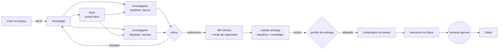

# agentic-dev-platform

**Agentes de IA que precisam provar o que fizeram.**

[](https://github.com/amonmelo/agentic-dev-platform/actions/workflows/ci.yml)


Uso agentes de IA todo dia pra resolver demanda de sustentação: ler o card, achar a causa, corrigir, provar.
O problema nunca foi o agente escrever código. Foi ele dizer "pronto" sem ter terminado.

Este repositório é a versão aberta da plataforma que montei no meu trabalho com o Claude Code.
A ideia central é simples: **medir o que o agente faz de verdade e colocar um portão onde ele erra.**

## Por que existe

Entre agosto e outubro de 2026, a versão interna rodou **282 subagentes**, **122 workflows** e mais de **2.200 ações de navegador**.
Com o log de tudo isso, apareceram os buracos:

| O que os dados mostraram | O que virou |
|---|---|
| O recibo de validação era pulado em **26 de 39** rodadas que editaram código | `portao_entrega`: o agente não encerra sem recibo |
| **46 de 52** buscas na raiz do disco vinham de subagentes, com até **124 s** cada | `guarda_busca`: bloqueia e manda buscar no repositório |
| Depois de compactar o contexto, o agente esquecia em que etapa estava | `retomada`: devolve etapa, próximo passo e definição de pronto |
| Achado "óbvio" que estava errado virava correção na causa errada | subagente `cetico`: tenta derrubar cada achado antes de virar código |

Nenhuma dessas regras veio de achismo. Primeiro medi, depois criei a regra.

## Como funciona



Por baixo de tudo, os hooks gravam cada ferramenta, subagente e falha em `.agentic/eventos.jsonl`.
O `agentic-metricas` lê esse log e diz onde mexer.

## Instalar em qualquer repositório

```bash
pip install git+https://github.com/amonmelo/agentic-dev-platform
agentic-instalar /caminho/do/seu/repo
```

O instalador não apaga nada. Mantém seus hooks, suas permissões e seus servidores MCP.
Skill com o mesmo nome só é sobrescrita com `--forcar`. Quer ver antes? Use `--dry`.

Depois é abrir o Claude Code no repositório e rodar `/investigar`.

## O que vem dentro

**Skills** (`.claude/skills/`)

| Skill | O que faz |
|---|---|
| `/investigar` | Do card ao diff mínimo. Reproduz com dado real, testa hipóteses em paralelo, só aceita o que o cético não derrubou |
| `/validar-entrega` | Roda os mesmos casos na versão anterior e na nova. O bug tem que falhar antes e passar depois. Gera o recibo |
| `/code-review` | Três níveis (crítico, importante, melhoria), detecta "diff fantasma" e passa cada achado pelo cético |

**Subagentes** (`.claude/agents/`)

| Agente | Papel | Modelo |
|---|---|---|
| `leitor` | Extrai fatos de print, arquivo ou query. Não interpreta | haiku |
| `investigador` | Uma hipótese por vez. Sem `arquivo:linha`, não é evidência | sonnet |
| `cetico` | Tenta derrubar o achado. Na dúvida, refuta | sonnet |

O leitor roda no modelo mais barato porque só copia. O cético roda num modelo melhor porque é ele que segura a qualidade.

**Hooks** (`src/agentic_platform/hooks/`)

| Hook | Evento | Comportamento |
|---|---|---|
| `observabilidade` | Pre/PostToolUse, falha, SubagentStop, PreCompact | Grava tudo em JSONL |
| `guarda_busca` | PreToolUse | Nega `find /`, `grep -r ... /`, `Get-ChildItem C:\ -Recurse` e devolve o motivo ao modelo |
| `portao_entrega` | Stop | Bloqueia o encerramento se houve edição depois do último recibo aprovado |
| `retomada` | SessionStart (compact) | Devolve o estado da tarefa ao modelo |

**Servidor MCP** (`agentic-mcp`)

| Ferramenta | |
|---|---|
| `asana_listar_tarefas`, `asana_criar_tarefa`, `asana_comentar` | Lê e atualiza o trabalho |
| `sheets_ler` | Lê planilhas do Google Sheets |
| `slack_rascunhar` | Escreve a mensagem, **não envia** |
| `slack_enviar` | Envia só rascunho que um humano aprovou com `agentic-aprovar` |

Sem token no ambiente, tudo roda em modo demo, offline. Com `ASANA_TOKEN`, `SLACK_BOT_TOKEN` ou `GOOGLE_ACCESS_TOKEN`, usa as APIs reais.

## Decisões que valem explicar

**Mensagem pra pessoa só sai com aprovação humana.**
Aprendi do jeito difícil: um agente meu respondeu sozinho uma mensagem importante, com texto genérico, e não tinha como desfazer.
Agente pode escrever à vontade. Quem aperta enviar é gente.

**O cético refuta na dúvida.**
Corrigir a causa errada sai mais caro que investigar de novo. Então o padrão é desconfiar.

**Recibo sem evidência não vale.**
`agentic-recibo --aprovado` sem `--evidencia` dá erro. "Testei e funcionou" não é prova.

**Hook testado do jeito que roda.**
Os testes sobem cada hook como processo separado, mandam o JSON no stdin e conferem exit code e saída. Igual o Claude Code faz.

**Estado em arquivo simples.**
JSONL, JSON e SQLite em `.agentic/`. Dá pra auditar com `cat` e não depende de serviço nenhum.

## Medindo seus agentes

```bash
agentic-metricas
```

Quer ver sem instalar em nada? `python examples/log_demo.py` gera um log sintético com as proporções medidas na versão interna e roda as métricas:

```
Sessões: 39 · chamadas: 130 · falhas: 0
Subagentes: 78 · compactações: 0
Editaram código: 39 · sem recibo: 26
Buscas na raiz: {'investigador': 46, 'principal': 6}

O que melhorar:
- 66% das sessões que editaram código terminaram sem recibo de validação. Confirme que o hook portao_entrega está ligado no Stop.
- 52 buscas na raiz do disco (46 vindas de subagentes). Passe o caminho do repositório no prompt do subagente e mantenha o guarda_busca ativo.
```

`agentic-metricas --json` devolve o mesmo em JSON, pra jogar num dashboard.

## Testado com o Claude Code de verdade

Teste unitário verde não basta. Instalei num repositório vazio e rodei o Claude Code em cima.

**Portão de entrega.** Pedi: "crie soma.py com uma função soma(a, b) e encerre".
O agente criou o arquivo e tentou encerrar. O portão segurou.
Sozinho, ele escreveu `test_soma.py`, rodou o pytest (4 passed), gerou o recibo com essa evidência e só então encerrou.

**Guarda de busca.** Pedi pra rodar `find / -maxdepth 1 -name nada_aqui`. O comando foi negado antes de executar e o agente recebeu o motivo.

Esse teste achou dois problemas que os testes unitários não pegavam:

- No Windows, o agente usou a ferramenta PowerShell, não Bash. A guarda só olhava Bash. Agora olha os dois.
- No Windows, o Claude Code tratou o exit code 2 do hook como erro não bloqueante e rodou o comando mesmo assim. A guarda passou a responder pelo JSON do protocolo (`permissionDecision: deny`), que funciona igual em todo sistema.

## Testes

```bash
pip install -e ".[dev]"
pytest -q
```

44 testes. Os hooks rodam como processo separado com o JSON no stdin, igual o Claude Code faz.
Os do MCP sobem o servidor e conversam com ele pelo protocolo, via stdio.
O CI roda em Python 3.11 e 3.12.

## O que ainda falta

- OAuth do Google: hoje recebe um access token pronto.
- Métricas por repositório. Juntar vários repositórios num painel só é o próximo passo.
- Gravação de vídeo no `/validar-entrega` está descrita na skill, mas o código de gravação ficou na versão interna.

## Autor

**Amon Melo**, engenheiro de software. Python, integrações e engenharia assistida por IA.
[LinkedIn](https://linkedin.com/in/amonmelo)
